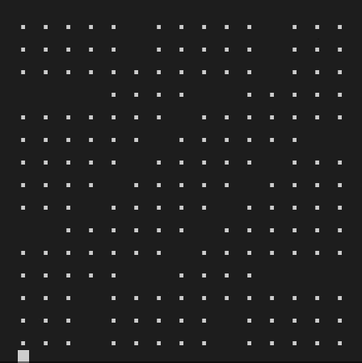

# ⚔️ swordsmith.py

Forging crosswords, word by word.



## How to Use

From this folder, run `pip install -e .` to install Swordsmith.

In the command line, run `python3 swordsmith` using any of these optional command line flags:

```
usage: swordsmith.py [-h] [-w WORDLIST_PATH] [-m MIN_SCORE] [-g GRID_PATH] [-t NUM_TRIALS] [-a] [-s STRATEGY] [-k K] [-r RETRY_SECONDS]

options:
  -h, --help            show this help message and exit
  -w WORDLIST_PATH, --wordlist WORDLIST_PATH
                        filepath for wordlist
  -m MIN_SCORE, --min-score MIN_SCORE
                        minimum word score
  -g GRID_PATH, --grid GRID_PATH
                        filepath for grid
  -t NUM_TRIALS, --num-trials NUM_TRIALS
                        number of grids to try filling
  -a, --animate         whether to animate grid filling
  -s STRATEGY, --strategy STRATEGY
                        which algorithm to run: dfs, dfsb, minlook, mlb
  -k K, --k K           k constant for minlook
  -r RETRY_SECONDS, --retry-seconds RETRY_SECONDS
                        number of seconds after which to reshuffle wordlist and retry
```

For example:

```
python3 swordsmith -w spreadthewordlist.dict -g 7xopen.txt -a
```

## Background

A crossword is a puzzle where the solver must fill a grid of crossing slots with words. Each slot consists of a sequence of squares, where each square is to be filled with a letter. If one square is part of multiple slots, the slots are said to be crossing at that square. A slot's word is the concatenation of the letters in each of the slot's squares. The grid is validly filled if every square has a letter and every slot's word is valid.

An American-style crossword consists of a two-dimensional grid of black and white squares, where every maximally contiguous horizontal or vertical sequence of white squares is a slot. In this special case of the crossword, every white square is necessarily part of two slots, a horizontal and vertical slot. Black squares are not part of any slot.

## Relevant Papers

- [Computer construction of crossword puzzles using precedence relationships](https://www.sciencedirect.com/science/article/pii/0004370276900199) (Mazlack, 1976)
- [Search Lessons Learned from Crossword Puzzles](https://www.aaai.org/Papers/AAAI/1990/AAAI90-032.pdf) (Ginsberg et al, 1990)
- [Dynamic Backtracking](https://arxiv.org/pdf/cs/9308101.pdf) (Ginsberg, 1993)
- [Constraint Programming Lessons Learned from Crossword Puzzles](https://cs.uwaterloo.ca/~vanbeek/Publications/cai01a.pdf) (Beacham et al, 2001)
- [Crossword Puzzles and Constraint Satisfaction](https://cs.uwaterloo.ca/~vanbeek/Publications/cai01a.pdf) (Connor et al, 2005)

## Contributing

Originally a solo project by Adam Aaronson, then briefly a group project with Jack Joshi, JT Kirages, and Mark Bauer, Swordsmith is now an open-source sandbox for experimenting with crossword filling algorithms. We encourage you to clone and fork this project to play around with it yourself, and submit pull requests to add your own improvements! Possible contributions might include:

- Improvements to existing filling algorithms
- New filling algorithms that use other strategies
- Implementations in other languages
- Generalizations to other types of puzzles (British-style crosswords, Marching Bands, Rows Garden, etc.)

---

## Documentation

### Crossword

Represents a collection of crossing slots and the words they contain. A slot is a unique tuple of squares, and a square is a unique tuple of coordinates. Every slot has a corresponding word whose `i`th character corresponds to the `i`th square of the slot. Words can be filled, partially `EMPTY`, or completely `EMPTY`.

If two slots contain the same square, their words "cross" at that square and their letters corresponding to that square must be the same.

#### Fields

- `slots`
  - Set of slots in the crossword
- `squares`
  - Dictionary of dictionaries that keeps track of which slots contain which squares
  - square => slot => index of square within slot
- `crossings`
  - Dictionary of dictionaries that keeps track of which slots cross each other
  - slot => slot => square where the slots cross
- `words`
  - Dictionary mapping each slot to its corresponding word
  - Updated as grid is filled
- `wordset`
  - Set of filled words in the grid
  - Used for dupe detection
  - Updated as grid is filled

#### Static Methods

- `is_word_filled(self, word)`
  - Returns whether `word` is completely filled

#### Methods

- `put_letter(self, slot, i, letter)`
  - Places given `letter` at `i`th square of given `slot`
  - Does not update crossing slots
- `put_word(self, word, slot, add_to_wordlist=True)`
  - Places `word` in the given `slot`
  - By default it should add it to the wordlist if it isn't already included, but if a filler is restoring a previous word then `add_to_wordlist` can be set to `False`
  - Updates words in crossing slots using `put_letter`
- `is_dupe(self, word)`
  - Returns whether `word` is a dupe, i.e. whether it's already in the `wordset`
- `is_filled(self)`
  - Returns whether every square in the grid is non-`EMPTY`

---

### American Crossword

Represents a special case of the crossword that consists of a two-dimensional grid of black and white squares, where every maximally contiguous horizontal or vertical sequence of white squares is a slot. Black squares are also called blocks and they are not a part of any word.

#### Fields

- `rows`
  - Number of rows in the grid
- `cols`
  - Number of columns in the grid
- `grid`
  - `rows` by `cols` array of characters representing the letters in each square of the grid

#### Class Methods

- `from_grid(cls, grid)`
  - Generates a crossword from 2D array of characters

#### Static Methods

- `is_across_slot(slot)`
  - Determines whether the given slot is an Across slot
- `is_down_slot(slot)`
  - Determines whether the given slot is a Down slot

#### Methods

- `get_clue_numbers_and_words(self)`
  - Returns dictionaries of across and down words, indexed by their numbers à la newspaper crossword
- `put_block(self, row, col)`
  - Places `BLOCK` at given square
- `put_blocks(self, coords)`
  - Places `BLOCK` at all of the given squares in the list `coords`
- `__generate_grid_from_slots(self)`
  - Processes `slots` to refresh the grid array
  - Called whenever the grid is about to be printed, in case the contents of the slots have changed
- `__generate_slots_from_grid(self)`
  - Processes `grid` array to generate the across and down slots
  - Called whenever grid shape changes

---

### Wordlist

Contains the collection of words to be used while filling a crossword, as well as the pattern-matching functionality for filling an incomplete slot.

#### Fields

- `words`
  - Set of words in the wordlist
- `added_words`
  - Set of words that weren't originally in the wordlist, but were added while the program was running
- `pattern_matches`
  - Dictionary that holds matches for previously searched patterns
- `indices`
  - Dictionary mapping length to index to letter to set of words
  - Used for simulating database indexing
- `lengths`
  - Dictionary mapping length to words
  - Used for finding matches for completely unfilled slots

#### Methods

- `add_word(self, word)`
  - Adds `word` to the wordlist
- `remove_word(self, word)`
  - Removes `word` from the wordlist
- `get_matches(self, pattern)`
  - Returns list of words in the wordlist that match `pattern`
  - `pattern` is a string with any number of wildcard (`EMPTY`) characters

---

### Filler

Abstract base class containing useful methods for filling crosswords.

#### Abstract Methods

- `fill(self, crossword, wordlist, animate)`
  - Fills the given `crossword` using some strategy
  - Can optionally `animate` the filling process by printing out the grid at each step

### Static Methods

- `get_new_crossing_words(crossword, slot, word)`
  - Returns words that would cross the given `slot` if the given `word` was entered into it, without actually placing the `word` in
  - Used for `minlook` heuristic and `is_valid_match`
- `is_valid_match(crossword, wordlist, slot, match)`
  - Returns whether the `match` can be placed in the `slot` without creating a dupe or invalid word.
- `fewest_matches(crossword, wordlist)`
  - Returns the unfilled slot in the grid with the fewest matches according to the `wordlist`, as well as its number of matches
  - Used as a next-slot heuristic
- `minlook(crossword, wordlist, slot, matches, k)`
  - Randomly looks at `k` possible `matches`
  - Returns index of match that yields the most possible crossing words if it were placed in the `slot`, as well as the indices of matches that immediately cause inconsistencies
  - Determines number of crossing words by computing the sum of logarithms of crossing match counts
  - Used for `minlook` and `arc-consistency` heuristic

---

### DFSFiller

Implementation of `Filler` that uses a naive DFS algorithm.

#### Methods

- `fill(self, crossword, wordlist, animate)`
  - If the grid is already filled, just return `True`
  - Choose next slot to fill using `fewest_matches` heuristic
    - If `num_matches` is zero, crossword is unfillable, return `False`
  - Randomly iterate through all possible matches for that slot
    - If the match can be placed without creating a dupe or invalid word, then recurse
  - If none of the matches worked, restore the slot's previous word and return `False`

---

## MinlookFiller

Implementation of `Filler` that uses a minlook heuristic, as described in Ginsberg et al's 1990 paper [Search Lessons Learned from Crossword Puzzles](https://www.aaai.org/Papers/AAAI/1990/AAAI90-032.pdf).

#### Fields

- `k`
  - Number of potential matches to look ahead to at each fill step

#### Methods

- `fill(self, crossword, wordlist, animate)`
  - If the grid is already filled, just return `True`
  - Choose next slot to fill using `fewest_matches` heuristic
    - If `num_matches` is zero, crossword is unfillable, return `False`
  - Use `minlook` to look ahead to at most `k` random matches and find the one that yields the most possible crossing matches
    - Throw out both the chosen match and the failed matches from the matches list
    - If the chosen match can be placed without creating a dupe or invalid word, then recurse
    - If the chosen match didn't work and there are more matches to try, use `minlook` again
  - If none of the matches worked, restore the slot's previous word and return `False`
